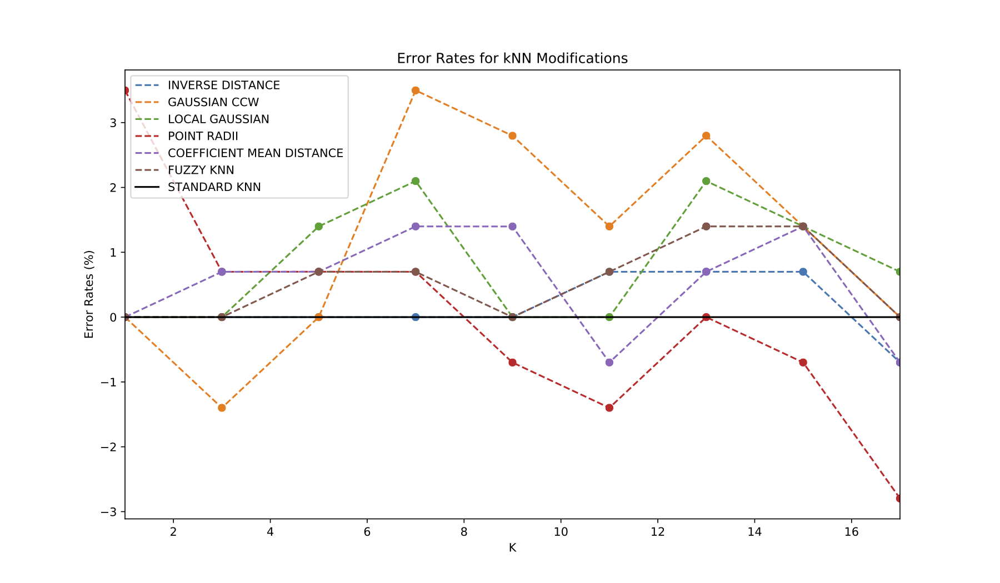

# knn_adaptive_algorithm

## Project Description
The kth-Nearest-Neighbors (kNN) algorithm is a simple classification algorithm that utilizes the euclidean distances between the query point and training set to determine classification. This project utilized the breast-cancer dataset and implemented two types of modification to the standard kNN algorithm: 
- Modifying how the nearest neighbors are determined
- Determining the confidence of neighbors

## Modifications
`knn_adaptive_algorithm.py` offers 6 different modifications to the standard kNN algorithm
- **Inverse Distances**: Weights closer neighbors such that they have more influence on the classification of the query point. 
- **Gaussian CCW**: Assigns non-linear weights to a neighbor's features based on the dataset's mean and standard deviation for each class. Each neighbor is subsequently given a class confidence weight (CCW) depending on how likely it represents its class cluster. If the ratio of benign confidence over malignant confidence is greater than 1, the sample is classified as benign. Method adopted from Liu and Chawla's paper: ["Class Confidence Weighted kNN Algorithms for Imbalanced Data Sets"](https://link.springer.com/chapter/10.1007/978-3-642-20847-8_29)
- **Local Gaussian**: Utilizes the mean and standard deviation of the kth nearest neighbors to try and find the confidence of the query point in relation to both malignant and benign local probability distributions, returning the class that gives a higher confidence value to the query point.
- **Point Radii**: Each point in the data set receives a "point radius," a value that shows how large of a circle can be formed without including a point of the other class. Neighbors are then determining by dividing the euclidean distance between the query point and a given training example by the training example's point radius value. Method adopted from Wang, Neskovic, and Cooper's paper: ["Improving Nearest Neighbor Rule with a Simple Adaptive Distance Measure"](http://citeseerx.ist.psu.edu/viewdoc/download?doi=10.1.1.71.281&rep=rep1&type=pdf)
- **Coefficient Mean Distance**: Looks at the proportion of the mean distance between the neighbors and the query point (µref) as well as the neighbors and their respective class means (µclass). The alpha coefficient measures proportion of the neighbors of a certain class. See `figures/coefficient_mean_distance.pdf` for a schematic representation.
- **Fuzzy kNN**: Gives each neighbor a weight depending on its distance from the query point. Probabilities are determined by adding weighted values for each class together. Classification is given by the highest weighted probability. Method adopted from Sarkar and Leong's paper: ["Application of K-Nearest Neighbors Algorithm on Breast Cancer Diagnosis Problem"](https://www.ncbi.nlm.nih.gov/pmc/articles/PMC2243774/)

## Error Rates Relative to Standard kNN

## Future Plans
- Implement cross-validation
- Test efficiency of methods using other metrics of performance (e.g. recall, precision, ROC)
- Train other machine learning models (e.g. Naive Bayes, Support Vector Machines) 